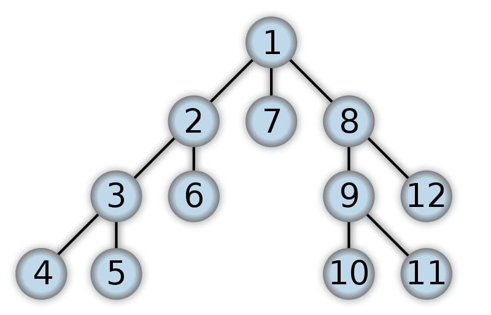

## 1. Recursion

Recursion, while not an algorithm itself, is a fundamental concept utilized in algorithm design.

**Recursion** involves a function calling itself within its definition.

It proves particularly effective for tasks featuring repeated subtasks.

Recursion is ubiquitous, appearing in various contexts such as:

- **DOM Traversal:** Navigating through the Document Object Model (DOM) of a web page often involves recursive operations.
  
- **Nested Objects:** In JavaScript, recursion is evident when dealing with objects containing nested objects.

Every recursive function must include a **base case** to halt the recursion. Failing to establish a base case can lead to the Stack Overflow Problem.

In recursion, both the base case and the recursive case must return values. The base case signals termination, while the recursive case propagates the desired result.

Recursion offers a powerful tool for solving problems with repetitive structures, providing elegant and concise solutions.

## 2. Sorting

Sorting might not be a primary concern when dealing with small datasets. However, the choice of sorting algorithm becomes critical when handling large volumes of data. Each problem requires a sorting method that best suits its characteristics. For instance, Google would employ its own sorting algorithms to arrange search results based on specific criteria, while Amazon and Netflix would utilize different algorithms for sorting products by categories or date.

One issue with the built-in sorting functionalities of most programming languages is their generic nature, which may not always align with your specific requirements.

While you may not typically implement your own sorting algorithms in your daily tasks, understanding how these algorithms work can greatly enhance your engineering skills. Familiarity with the trade-offs associated with each algorithm enables you to make informed decisions about when to use which sorting method.

### When to Use What ? 
Insertion sort is suitable for smaller sizes and nearly sorted data. However, bubble sort and selection sort are rarely used outside of educational contexts.

If you're concerned about worst-case scenarios, merge sort is a viable option. However, it consumes more space, so it may not be ideal if memory is limited.

In practice, merge sort and quick sort are among the most commonly used sorting algorithms due to their divide-and-conquer approach, which achieves O(n log(n)) performance.

### Comparison vs. Non-comparison Algorithms

All the algorithms discussed above are comparison algorithms (bubble sort, selection sort, insertion sort, merge sort, quick sort), which means they compare each element with another and adjust their order accordingly. The best time complexity achievable with these algorithms is O(n log(n)). However, there are non-comparison algorithms (such as radix sort and counting sort) that can guarantee much faster times, but they only work on lists of integers within a fixed range.

For more information on non-comparison algorithms:

- [Radix Sort | Brilliant Math & Science Wiki](https://brilliant.org/wiki/radix-sort/)
- [Counting Sort | Brilliant Math & Science Wiki](https://brilliant.org/wiki/counting-sort/)

## 3. Searching

Searching is a ubiquitous operation in our daily lives, facilitating tasks such as finding files on our computers, searching for specific words or phrases on a webpage, or seeking information on search engines like Google or YouTube. But how do these searches happen so swiftly, and how do companies manage search capabilities in their products?

### Linear Search

Linear search is a straightforward method for finding a target value within a list. In this algorithm, we iterate over the entire list, comparing each element with the target value until a match is found.

It operates with a time complexity of O(n), indicating linear time. In JavaScript, functions like `indexOf`, `findIndex`, `find`, and `includes` perform linear searches on lists.

However, if the list is sorted, a more efficient approach becomes possible.

### Binary Search

When the list is sorted, binary search offers improved efficiency over O(n).

In binary search, we exploit the sorted nature of the list. Instead of scanning all elements, we compare the target value with the middle element of the list. Based on this comparison, we narrow down the search to either the left or right half of the list, effectively halving the search space. This process continues recursively until the target value is found or the search space is exhausted.

Binary search operates with a time complexity of O(log(n)), significantly faster than linear search.

### Graph & Tree Traversals

Traversal, or visiting every node in a tree or graph, is a common operation, particularly in algorithms such as Divide and Conquer.

Two popular algorithms for traversing graphs and trees are **Breadth First Search (BFS)** and **Depth First Search (DFS)**.

#### Breadth First Search (BFS)

BFS traverses a tree or graph level by level, starting from the root node and moving horizontally to neighboring nodes before descending deeper.

It requires additional memory to keep track of visited nodes but is efficient in finding the shortest paths.
    

#### Depth First Search (DFS)

DFS explores a tree or graph by going as deep as possible along each branch before backtracking.

It requires less memory but may be slower on deep graphs or trees.

Both algorithms have their strengths and are suitable for different scenarios.
    

### BFS vs DFS

- BFS is effective for finding shortest paths but requires more memory.
  
- DFS consumes less memory and can determine if a path exists between nodes.

#### Video Resource: 

[Graph Traversals - BFS & DFS](https://www.youtube.com/watch?v=pcKY4hjDrxk)

#### Question & Answers:

```markdown
- If a solution is close to the root:
	-- BFS

- For deep trees with rare solutions:
	-- BFS (DFS can take a long time)

- For wide trees:
	-- DFS (BFS requires excessive memory)

- For frequent solutions deep in the tree:
	-- DFS

- To determine if a path exists between nodes:
	-- DFS

- For finding the shortest path:
	-- BFS
```

For finding the shortest path in a weighted graph, algorithms like Bellman or Dijkstra are preferred, with Bellman's algorithm suitable for graphs with negative weights and Dijkstra's algorithm for positive weights. BFS does not utilize weights to find the shortest path.

## 4. Dynamic Programming

Dynamic programming serves as an optimization technique, leveraging caching to enhance computational efficiency.

In essence, dynamic programming resolves complex problems by breaking them down into a series of smaller, manageable subproblems. Once these subproblems are solved, their solutions are stored or cached. Consequently, if the same subproblem recurs, its solution can be retrieved from the cache, circumventing redundant computations.

### Memoization

Memoization, a key facet of dynamic programming, accelerates program execution by caching the outcomes of resource-intensive function calls. When encountering identical inputs in subsequent invocations, previously computed results are promptly retrieved from memory.

Repeatedly solving identical problems consumes time and inflates overall program runtime. Memoization mitigates this issue by preserving calculated results in memory, thereby reducing time complexity.

Memoization epitomizes a specific form of caching, focusing on storing function return values contingent on input. While caching encapsulates a broader concept, memoization specifically pertains to caching function outcomes based on input parameters.

To ascertain whether a problem can benefit from dynamic programming optimization, consider the following steps:

1. **Divisibility into Subproblems:** Can the problem be decomposed into smaller, solvable subproblems?
2. **Recursive Solution:** Is there a recursive approach to solving the problem?
3. **Repetitive Subproblems:** Do recurring subproblems emerge during the solution process?
4. **Subproblem Memoization:** Can subproblems be memoized to store their solutions for future use?

By adhering to these steps, one can effectively identify and leverage dynamic programming optimizations to streamline problem-solving processes.