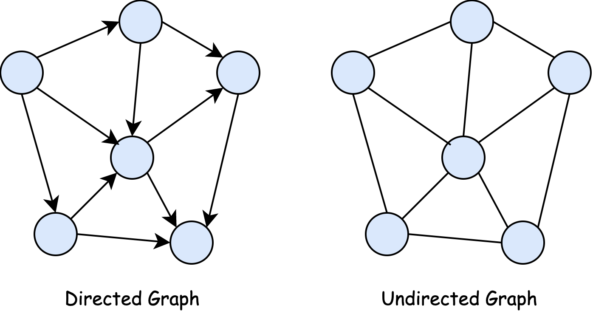
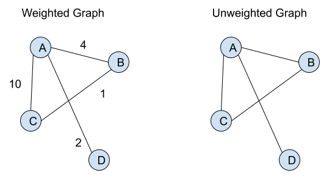
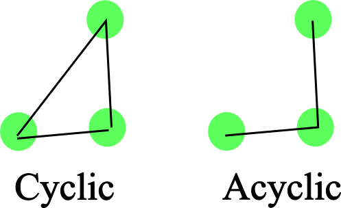

# Arrays

Arrays, sometimes referred to as lists, organize items sequentially, one after another.

Arrays are the simplest and most commonly used data structure. They are ideal when you need to store data and iterate over it sequentially.

**Operations:**
- Lookup: O(1)
- Push: O(1)
- Insert: O(n)
- Delete: O(n)

## Static vs Dynamic Arrays

**Static Arrays:** 
Fixed in size, requiring the specification of the number of elements beforehand.

**Dynamic Arrays:**
Expand as new elements are added, so you don't need to specify the number of element when initializing it.

In dynamic arrays, adding an element might incur an O(n) time complexity because the array might need to be resized. However, some operations, such as pushing a new value, can be O(1).

In lower-level languages like C and C++, dynamic arrays require manual memory management using functions like `new` in C++ or `malloc` in C. Higher-level languages typically handle memory allocation automatically.

# Hash Tables

Hash tables, also known as hash maps, maps, unordered maps, or dictionaries, are fundamental data structures.

In programming languages like JavaScript, objects are a type of hash tables, while Python uses dictionaries, and Java offers Maps.

In contrast to arrays, where values are accessed via indices and stored sequentially in memory, hash tables utilize key-value pairs. A hash function maps each key to an address in memory, facilitating efficient storage and retrieval of values.

## What is a Hash Function?

A hash function generates a fixed-length value for each input it receives. Key attributes of a hash function include:

- It is a one-way function.
- It returns the same output for the same input.
- It produces different outputs for different inputs.

Hash tables offer fast access to data, making them invaluable in various data structures.

When storing key-value pairs in a hash table, the hash function determines where to store them in memory based on the generated hash.

## Hash Collisions

Hash tables exhibit the following time complexities:

- Insert: O(1)
- Lookup: O(1)
- Delete: O(1)
- Search: O(1)

While these complexities make hash tables highly efficient, hash collisions can occur. 


A **hash collision** arises when two elements share the same memory address. Although it's improbable for two keys to have identical hashed values, the memory address derived from the hash may not be unique due to its limited bit representation.

In the event of a collision, a linked list is formed, with the later-added element appended to the previously existing one.

Numerous methods exist to address hash collisions in hash tables.

To gain a better understanding of hash collision resolution, explore the visualization provided by [Open Hashing Visualization (usfca.edu)](https://www.cs.usfca.edu/~galles/visualization/OpenHash.html).

# Linked List

Linked lists are essential data structures offering unique advantages over arrays.

## Why Use Linked Lists?

While arrays, both static and dynamic, have fixed or limited memory allocations, linked lists provide dynamic memory management. When arrays are full and require resizing, elements need to be copied to a new location, incurring a time complexity of O(n). Additionally, inserting or deleting elements in arrays necessitates shifting indexes, also O(n) operations.

Linked lists mitigate these issues:

- Prepend: O(1)
- Append: O(1)
- Lookup: O(n)
- Insert: O(n)
- Delete: O(n)

Unlike arrays, linked lists do not require shifting elements during insertions or deletions; instead, they adjust pointers.

### Array Advantages over Linked Lists 

Arrays offer fast access to elements via indices, with a time complexity of O(1). In contrast, linked lists require iteration (traversal) to find a specific value, resulting in a time complexity of O(n).

Moreover, arrays benefit from sequential memory access, leveraging computer caching systems for faster iteration compared to linked lists.

## What is a Linked List?

A linked list comprises nodes connected by pointers.

- Each node contains a data value and a pointer to the next node.
- The first node, known as the head, and the last node, the tail, define the linked list. The tail points to null.

Linked lists may not be available in all programming languages. For instance, in JavaScript, you need to implement them from scratch.

Explore a visual representation of linked lists at [Linked List (Single, Doubly), Stack, Queue, Deque - VisuAlgo](https://visualgo.net/en/list).

### What is Garbage Collection?

Consider the following code snippet:

```javascript
let obj1 = {a: "Hello"};
let obj2 = obj1;
obj1.a = "Hi";

delete obj1;
obj2 = "Hello";
console.log(obj2);
```

This snippet exemplifies garbage collection in action. Initially, `obj1` and `obj2` both reference the same memory location. When `obj1` is deleted and `obj2` is reassigned, the original memory space becomes inaccessible. Despite this, the memory retains the value it held, creating what is known as "garbage."

Garbage collection is the process by which a programming language automatically detects and deletes unreferenced memory. In the case above, JavaScript identifies the memory space previously occupied by `obj1` as garbage and deallocates it, ensuring efficient memory management.

### Doubly Linked List

The doubly linked list shares similarities with the singly linked list but introduces a key enhancement: each node contains pointers to both the next and previous elements.

In a singly linked list, each node only holds the address of the next element, limiting traversal to forward direction. However, in a doubly linked list, nodes store references to both the next and previous elements, enabling traversal in both forward and backward directions. This bidirectional capability enhances the flexibility and functionality of the linked list data structure.

## Stacks and Queues

Stacks and queues are both linear data structures, allowing traversal through data elements one by one, with direct access to only one element at a time.

The primary distinction between these two structures lies in how elements are removed.

In stacks and queues, operations primarily involve adding or removing elements from either the beginning or the end of the data structure.

### Stacks (LIFO - Last In, First Out)

Imagine a stack of plates, each placed on top of the other, where only the topmost plate is visible and accessible. Stacks adhere to the **LIFO (Last In, First Out)** principle, meaning the last item added to the stack is the first one to be removed.

Stacks find extensive use cases, such as implementing the undo functionality in file systems or text editors, where the last action performed is the first one to be reversed.

**Operations:**
- Lookup: O(n)
- Pop: O(1)
- Push: O(1)
- Peek: O(1)

### Queues (FIFO - First In, First Out)

Visualize queues as lines of people waiting to enter a venue, where the first person to join the line is the first one to enter. Queues adhere to the **FIFO (First In, First Out)** principle.

Queues are practical in scenarios like managing reservation requests for an event, ensuring that the first person to reserve receives priority.

**Operations:**
- Lookup: O(n)
- Enqueue: O(1)
- Dequeue: O(1)
- Peek: O(1)

It's often advantageous to build data structures atop these fundamental structures to restrict the available operations, ensuring efficient and controlled usage. and that's why we use Stacks & Queues

## Trees

Trees are hierarchical data structures crucial in everyday computing.

They find application in various scenarios:

- **DOM Structure**: The Document Object Model (DOM) in web development represents a tree, with HTML as the root and nested elements like head and body.
  
- **Facebook Comments**: Comments on platforms like Facebook form a tree structure, where each comment can have replies, forming sub-comments, and so forth.
  
Linked lists can be seen as a simple form of a tree, with just one single path.


### Binary Tree

A binary tree imposes certain rules:

- Each node can have zero, one, or two children, and each child can have only one parent.
  
A **complete binary tree** has no gaps, meaning every level is filled, and the bottom level is filled from left to right. Such trees exhibit two properties:

- The number of nodes doubles as we move down the tree.
  
- The number of leaf nodes is the number of nodes above plus one.

### O(log(n))

In computer science, logarithm base 2 (log(n)) signifies how many times you can halve a number to reach 1. In the context of trees, it denotes the number of steps required to traverse the tree's height, aiding efficient searching.

For instance, in a complete binary tree with 8 nodes:

- Level 0: 1 node
- Level 1: 2 nodes
- Level 2: 4 nodes
- Level 3: 8 nodes

To search this tree, you would need log(8) or log(number of nodes) steps.

### Binary Search Tree (BST)

BSTs are binary trees adhering to specific rules:

- Values in the right subtree of a node must be greater, and those in the left subtree must be lesser.

**Operations:**

- Lookup: O(log(n))
- Insert: O(log(n))
- Delete: O(log(n))

While hash tables offer O(1) lookup, insert, and delete, trees preserve relationships. For example, organizing folders on a computer with a hash table would hinder accessing subfolders or navigating previous folders.

However, unbalanced BSTs pose a challenge, requiring O(n) time for operations due to resembling a singly linked list. Luckily, most programming languages include built-in methods to balance BSTs.

### Binary Heaps

Binary heaps are specialized binary trees where every node at the top level holds a value greater than all nodes in the level below (**parent nodes are always greater than their children**). There are two types of binary heaps: Max heap, where the values descend from the root, and Min heap, where the values ascend.

In contrast to binary search trees, where the right child must be greater and the left child lesser than the parent, binary heaps impose no such ordering. The sole requirement is that children must be greater than their parent. Consequently, searching or looking up values in binary heaps is less efficient, taking O(n) time instead of O(log(n)). Despite this, binary heaps excel in comparative operations. For instance, they are invaluable when identifying elements exceeding a certain threshold.

It's crucial to note that the memory heap (allocation space for dynamically allocated memory) is distinct from the heap data structure.

We do not need to rebalance a binary heap, unlike a binary search tree.

### Priority Queue

Binary heaps play a crucial role in Priority Queues.

In Priority Queues, each element possesses its priority, ensuring that elements with higher priorities are served before those with lower priorities.

Think of a nightclub queue where both regular attendees and VIPs await entry. VIPs, despite arriving later, are given precedence.

Another example is an emergency room queue in a hospital, where patients with critical conditions receive immediate attention.

## Graphs

Graphs are fundamental and extensively used data structures in computer science, particularly for modeling real-world scenarios.

**Graphs** are essentially a collection of values connected in pairwise fashion. They consist of nodes (vertices) and edges, where nodes represent elements, and edges denote relationships between nodes.

Graphs serve as excellent tools for representing relationships among objects in various contexts. For instance:

- The internet or the World Wide Web can be modeled using graphs.
  
- Google Maps utilizes graphs to calculate the shortest paths between locations.
  
- Social media platforms like Facebook employ graphs to depict friendships between users.
  
- Graphs are also used in representing road networks.

**Types of Graphs**

Graphs can be categorized in several ways:

1. **Directed vs. Undirected Graphs:**
   
   - In Directed graphs, edges have a specific direction, allowing movement from one node to another but not necessarily vice versa.
   
   - In Undirected graphs, edges are bidirectional, permitting movement between nodes in both directions.

   

2. **Weighted vs. Unweighted Graphs:**
   
   - Weighted graphs assign weights to edges, indicating the cost or distance between nodes.
   
   - Unweighted graphs do not have such weights associated with edges.

   

3. **Cyclic vs. Acyclic Graphs:**
   
   - Cyclic graphs contain cycles, allowing traversal from one node back to itself via a series of edges.
   
   - Acyclic graphs lack such cycles, preventing traversal back to the starting node.

   


Graphs are versatile structures with diverse applications, offering powerful representations for various real-world scenarios.