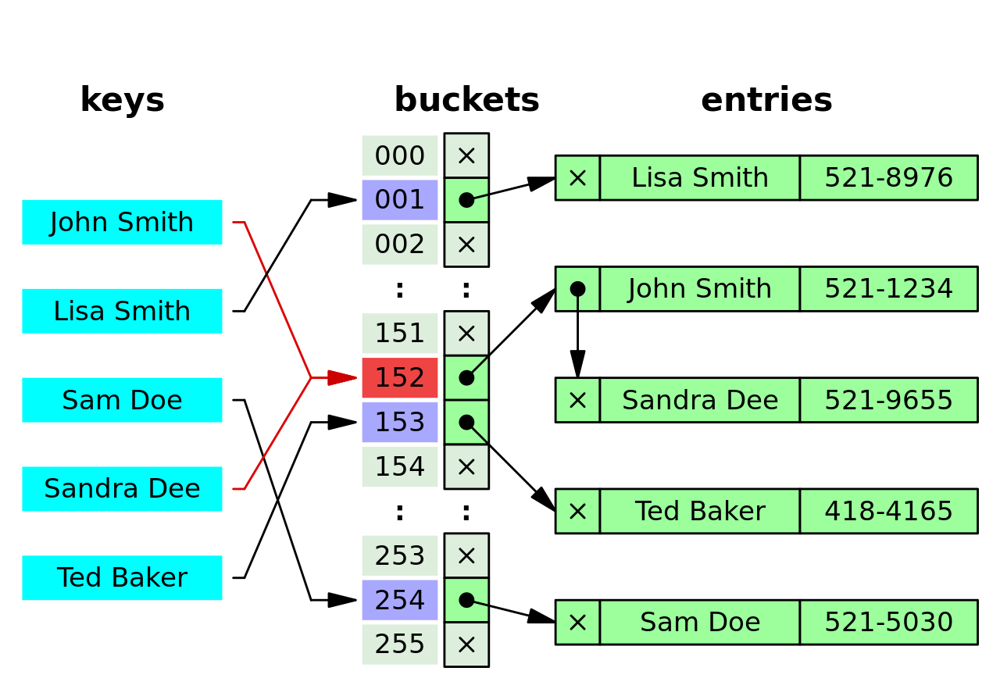

# Arrays

Arrays, sometimes referred to as lists, organize items sequentially, one after another.

Arrays are the simplest and most commonly used data structure. They are ideal when you need to store data and iterate over it sequentially.

**Operations:**
- Lookup: O(1)
- Push: O(1)
- Insert: O(n)
- Delete: O(n)

## Static vs Dynamic Arrays

**Static Arrays:** 
Fixed in size, requiring the specification of the number of elements beforehand.

**Dynamic Arrays:**
Expand as new elements are added, so you don't need to specify the number of element when initializing it.

In dynamic arrays, adding an element might incur an O(n) time complexity because the array might need to be resized. However, some operations, such as pushing a new value, can be O(1).

In lower-level languages like C and C++, dynamic arrays require manual memory management using functions like `new` in C++ or `malloc` in C. Higher-level languages typically handle memory allocation automatically.

# Hash Tables

Hash tables, also known as hash maps, maps, unordered maps, or dictionaries, are fundamental data structures.

In programming languages like JavaScript, objects are a type of hash tables, while Python uses dictionaries, and Java offers Maps.

In contrast to arrays, where values are accessed via indices and stored sequentially in memory, hash tables utilize key-value pairs. A hash function maps each key to an address in memory, facilitating efficient storage and retrieval of values.

## What is a Hash Function?

A hash function generates a fixed-length value for each input it receives. Key attributes of a hash function include:

- It is a one-way function.
- It returns the same output for the same input.
- It produces different outputs for different inputs.

Hash tables offer fast access to data, making them invaluable in various data structures.

When storing key-value pairs in a hash table, the hash function determines where to store them in memory based on the generated hash.

## Hash Collisions

Hash tables exhibit the following time complexities:

- Insert: O(1)
- Lookup: O(1)
- Delete: O(1)
- Search: O(1)

While these complexities make hash tables highly efficient, hash collisions can occur. 



A **hash collision** arises when two elements share the same memory address. Although it's improbable for two keys to have identical hashed values, the memory address derived from the hash may not be unique due to its limited bit representation.

In the event of a collision, a linked list is formed, with the later-added element appended to the previously existing one.

Numerous methods exist to address hash collisions in hash tables.

To gain a better understanding of hash collision resolution, explore the visualization provided by [Open Hashing Visualization (usfca.edu)](https://www.cs.usfca.edu/~galles/visualization/OpenHash.html).

# Linked List

Linked lists are essential data structures offering unique advantages over arrays.

## Why Use Linked Lists?

While arrays, both static and dynamic, have fixed or limited memory allocations, linked lists provide dynamic memory management. When arrays are full and require resizing, elements need to be copied to a new location, incurring a time complexity of O(n). Additionally, inserting or deleting elements in arrays necessitates shifting indexes, also O(n) operations.

Linked lists mitigate these issues:

- Prepend: O(1)
- Append: O(1)
- Lookup: O(n)
- Insert: O(n)
- Delete: O(n)

Unlike arrays, linked lists do not require shifting elements during insertions or deletions; instead, they adjust pointers.

### Array Advantages over Linked Lists 

Arrays offer fast access to elements via indices, with a time complexity of O(1). In contrast, linked lists require iteration (traversal) to find a specific value, resulting in a time complexity of O(n).

Moreover, arrays benefit from sequential memory access, leveraging computer caching systems for faster iteration compared to linked lists.

## What is a Linked List?

A linked list comprises nodes connected by pointers.

- Each node contains a data value and a pointer to the next node.
- The first node, known as the head, and the last node, the tail, define the linked list. The tail points to null.

Linked lists may not be available in all programming languages. For instance, in JavaScript, you need to implement them from scratch.

Explore a visual representation of linked lists at [Linked List (Single, Doubly), Stack, Queue, Deque - VisuAlgo](https://visualgo.net/en/list).

### What is Garbage Collection?

Consider the following code snippet:

```javascript
let obj1 = {a: "Hello"};
let obj2 = obj1;
obj1.a = "Hi";

delete obj1;
obj2 = "Hello";
console.log(obj2);
```

This snippet exemplifies garbage collection in action. Initially, `obj1` and `obj2` both reference the same memory location. When `obj1` is deleted and `obj2` is reassigned, the original memory space becomes inaccessible. Despite this, the memory retains the value it held, creating what is known as "garbage."

Garbage collection is the process by which a programming language automatically detects and deletes unreferenced memory. In the case above, JavaScript identifies the memory space previously occupied by `obj1` as garbage and deallocates it, ensuring efficient memory management.